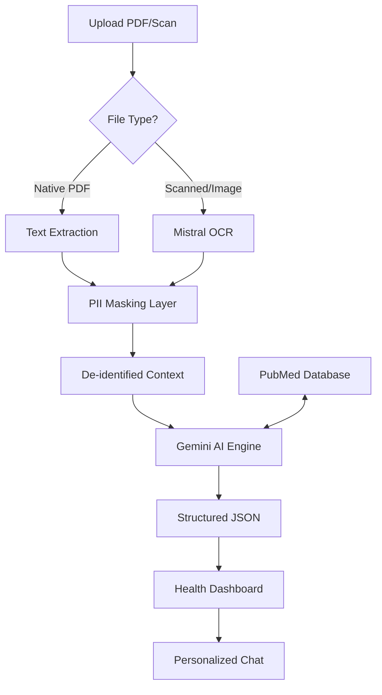

# 🩸 Clinical Lab Intelligence Platform

> An enterprise-grade, privacy-first platform for automated biomarker extraction and clinical data visualization. Using advanced LLMs grounded in medical literature (PubMed), this platform transforms raw laboratory data into structured health insights.

---

## 📊 Data Pipeline Architecture

---

## ✨ Key AI Features

### 🔍 Multimodal Ingestion
- **Mistral OCR integration**: Handles high-complexity scanned documents and interactive table layouts.
- **Hybrid Parsing**: Combines native data streams with visual recognition for maximum accuracy.

### 🔬 Evidence-Based Grounding
- **PubMed Integration**: All abnormal biomarkers trigger a real-time search of the **National Center for Biotechnology Information (NCBI)** database.
- **Clinical Citations**: Automated generation of blue-link PubMed references for every health insight.
- **Multi-Model Orchestration**: Dynamic fallback logic between **Gemini 1.5 Pro**, **GPT-4o**, and **Mistral Large** to ensure 99.9% uptime.

### 🛡️ Privacy & PII Masking
The platform employs a rigorous de-identification layer before any data reaches cloud AI providers:
- **Heuristic & ML-based Masking**: Names, addresses, phone numbers, and unique identifiers are replaced with tokens (e.g., `[NAME_1]`).
- **Encrypted Local Storage**: Data is only re-identified in the user's secure browser session.
- **HIPAA-Compliant Architecture**: Designed to meet strict healthcare data privacy requirements.

---

## 📈 Platform Capabilities
- **Biomarker Trends**: Interactive charts tracking value fluctuations across multiple reports.
- **Systematic Risk Analysis**: Categorization of health markers into Body Systems (Metabolic, Liver, Cardiovascular, etc.).
- **Interactive Medical Chat**: Context-aware assistant that understands your full lab history.

---

## 🛠️ Tech Stack

### Frontend
- **Framework**: React 18 with Vite
- **Styling**: Tailwind CSS & Shadcn/UI
- **Charts**: Recharts (Customized for Clinical Ranges)
- **State Management**: React Query & Context API

### Backend
- **API**: FastAPI (Python 3.11)
- **Auth**: Supabase Auth (Email/Password)
- **Intelligence**: Google Gemini, OpenAI, Mistral OCR
- **Grounding**: NCBI E-utilities (PubMed API)

---

## 🚀 Deployment

Optimized for **Render** deployment out of the box:
- **Frontend**: Static Site (Auto-build from `dist`)
- **Backend**: Containerized or native Python service
- **Environment**: Managed secrets for API keys and Supabase credentials.

---

